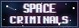

# 👋 Hi there, I'm Sam Fleming!

---
## 🚀 About Me

I am a neuro-spicy technologist who's passionate about encouraging others in security and innovation! I'm currently working as a **Consultant** at **Red Hat**, based in **Raleigh, NC**. I'm also an active member of the **Tailscale Insider** program and a vocal advocate for open source software, Zero-Trust networking, and community-driven development.

I believe in the power of connection and collaboration to drive success – whether I'm architecting cloud solutions, speaking at conferences on open source and security, moderating the r/Nerdio community, or teaching West Coast Swing on the dance floor. My mission is to deliver exceptional solutions while building meaningful relationships and fostering strong communities.

---

## 🛠️ My Favorite Tools

Here are the tools that power my daily workflow and boost my productivity:

<table>
<tr>
<td width="33" align="center">

### ⌨️ [NeoVim](https://neovim.io/)
**Hyperextensible Text Editor**

The modern evolution of Vim, built for extensibility and usability. My configuration transforms it into a full-featured IDE with LSP support, fuzzy finding, and custom keybindings tailored to my workflow.

🔧 [View my NeoVim config](https://github.com/SamPlaysKeys/dotfiles)

</td>
<td width="33%" align="center">

### 📁 [Yazi](https://yazi-rs.github.io/)
**Terminal File Manager**

A blazing fast terminal file manager written in Rust. Combines vim-like keybindings with modern features like image previews and async operations.

</td>
</tr>
<tr>
<td width="33%" align="center">

### 🧠 [Obsidian](https://obsidian.md)
**Knowledge Management**

My second brain for connecting ideas, managing projects, and building comprehensive documentation. The graph view and bidirectional linking make knowledge discovery effortless.

</td>
<td width="33%" align="center">

### 🚀 [Warp.dev](https://app.warp.dev/referral/GVGXKK)
**The AI-Powered Terminal**

The modern terminal that feels like an IDE. **However,** for my use case, I disable the included AI features. While it is a great tool for AI-driven development, I prefer to use it for its original purpose: as an intuitive modern terminal, written in Rust.

</td>
</tr>
</table>

---

## 🤖 [My AI Workspace](https://github.com/SamPlaysKeys/Workspace)

My centralized repository for collaborating with AI agents - a curated collection of Ansible playbooks, OpenShift troubleshooting guides, ArgoCD configs, and a meta-development system (Skills, Commands, Agents) that supercharges agentic workflows. Everything is built with **reproducible examples** using generic hostnames and `.example.yml` templates so you can adapt them to your own infrastructure.

**Tech Stack:**     

---

## 🎯 Featured Projects

### 🗺️ [RepoMap](https://github.com/SamPlaysKeys/Repository-Mapper)
A Python CLI and library that scans repositories for cross-file references in configuration files (YAML, JSON, TOML), building a dependency graph that can be exported as ASCII trees, Mermaid flowcharts, or machine-readable JSON. Perfect for understanding complex project structures and visualizing configuration dependencies.

**Tech Stack:**   

### 📄 [Markdown-Code-Extractor](https://github.com/SamPlaysKeys/Markdown-Code-Extractor)
A Python utility to extract code blocks from Markdown files based on trigger strings and export them to YAML format. Supports batch processing, multiple triggers, and concatenation of extracted blocks into multi-document YAML files.

**Tech Stack:**   

### 🔤 [Hack-Fonts Installation Package](https://github.com/SamPlaysKeys/hack-fonts)
An installation-focused collection of the Hack font family - a typeface specifically designed for source code. This repository provides easy access to the popular Hack fonts, known for their excellent readability and distinctive character shapes that make coding more pleasant and reduce eye strain.

**Tech Stack:**   

### 🏠 [Homelab Infrastructure](https://github.com/SamPlaysKeys/Workspace/tree/main/docs/homelab)
Design, architecture, and operations for a greenfield homelab rebuild — documented end-to-end across five logical environments (Prod, Test, Dev, User, IoT) with GitOps-driven promotion via Komodo, Tailscale overlay networking, UniFi VLANs, comprehensive observability, and full ADR-tracked planning.

**Tech Stack:**     

---

Looking for my "Scan to email" walkthrough for Google Cloud/Gmail?
While it may not be the most secure method, it's still a really common use case. My walkthrough is available publically on Reddit: [Yes, you CAN USE Gmail with a scanner!!](https://www.reddit.com/r/msp/comments/v77qy7/yes_you_can_use_gmail_with_a_scanner_heres_how_to/) 

---

## 🔧 Tech Stack & Skills

### Cloud Platforms

### Languages & Scripting

### Virtualization & Containers

### Enterprise Tools

---

## 🤝 Community & Involvement

- **🎤 Speaker** - Conference talks on Open Source Advocacy, Tailscale, Conditional Access Policies, and security
- **💃 Dance Instructor** - West Coast Swing social dancing
- **🎯 Lead Moderator** - r/Nerdio community (End User Computing) and Nerdio Valued Professional

---

## 📫 Let's Connect!

 

 

### 🤝 Open for Collaboration!

I'm always excited to work on interesting projects, especially those involving:
- **Tailscale architecture and integration**
- **Open Source Advocacy and community-driven development**
- **Cloud architecture and migration projects**
- **DevOps/GitOps pipeline design and automation**
- **Security and technical education**

Feel free to reach out if you'd like to collaborate, have questions about any of my projects, or just want to connect with a fellow tech enthusiast!

---

*“You keep asking why your work is not enough, and I don’t know how to answer that, because it is enough to exist in the world and marvel at it. You don’t need to justify that, or earn it. You are allowed to just live.”*  
*~ Becky Chambers, [A Psalm for the Wild-Built](https://www.goodreads.com/work/quotes/63655961)*

**Last updated:** October 2026

